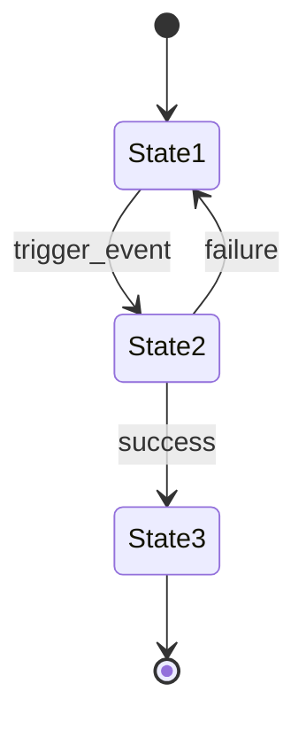

# Requirement Document Template

Use this template when producing the final optimized requirement document in Phase 10.

**Orientation**: This document is for **product decision-making**. It answers "Why are we building this?", "What are we building?", and "What are the priorities and trade-offs?" Implementation details (architecture, DDL, API specs, code interfaces) belong in the downstream auto-todo/auto-dev pipeline.

**Adaptive depth**: Not every section applies to every project. Sections marked `[IF APPLICABLE]` should be included only when the depth assessment warrants them. At minimum, every document must have sections 1-6.

---

```markdown
# [Product/Feature Name] — Requirement Document

**Date:** YYYY-MM-DD
**Author:** [User name] + AI-assisted requirement design
**Status:** Draft / Under Review / Approved
**Version:** 1.0
**Pipeline:** auto-requirement → auto-todo → auto-dev

---

## 1. Executive Summary

### 1.1 Problem Statement
[1-2 sentences: What problem are we solving? Why now? What is the cost of NOT solving it?]

### 1.2 Proposed Solution
[1-2 sentences: High-level approach to solving the problem]

### 1.3 Success Metrics
| ID | Metric | Current State | Target | Measurement Method | Timeline |
|----|--------|--------------|--------|-------------------|----------|
| KPI-1 | [Metric] | [Baseline] | [Goal] | [How to measure] | [When] |
| KPI-2 | [Metric] | [Baseline] | [Goal] | [How to measure] | [When] |
| KPI-3 | [Metric] | [Baseline] | [Goal] | [How to measure] | [When] |

---

## 2. Strategic Goals & Traceability

### 2.1 Strategic Goals

| ID | Goal | Why | Success Criterion | Priority |
|----|------|-----|-------------------|----------|
| SG-1 | [Goal] | [Rationale — why this goal matters] | [Measurable criterion] | Must/Should/Could |
| SG-2 | [Goal] | [Rationale] | [Measurable criterion] | Must/Should/Could |

### 2.2 Goal → Domain → Feature Traceability

```
SG-1: [Strategic Goal]
├── CD-1.1: [Capability Domain]
│   ├── FR-001: [Feature] (Must)
│   ├── FR-002: [Feature] (Should)
│   └── FR-003: [Feature] (Could)
├── CD-1.2: [Capability Domain]
│   ├── FR-004: [Feature] (Must)
│   └── FR-005: [Feature] (Must)
SG-2: [Strategic Goal]
├── CD-2.1: [Capability Domain]
│   └── FR-006: [Feature] (Should)
```

This tree is the **structural backbone** of the entire document. Every feature below traces back to this hierarchy.

---

## 3. User Personas & Scenarios

### 3.1 Primary Personas

**Persona 1: [Name/Role]**
- Background: [Who are they?]
- Goals: [What do they want?]
- Pain Points: [What frustrates them?]
- Usage Frequency: [Daily/Weekly/Occasional]
- **Domains they interact with:** [CD-1.1, CD-2.1, ...]

**Persona 2: [Name/Role]**
- ...

### 3.2 Key User Scenarios

**Scenario 1: [Title]** (linked to SG-[x])
- As a [persona], I want to [action] so that [benefit].
- **Preconditions:** [What must be true before]
- **Steps:** [Key interaction steps]
- **Expected Outcome:** [What success looks like]
- **Features touched:** [FR-001, FR-003, FR-005]

---

## 4. Capability Domains & Feature Hierarchy

This is the core of the document. Each capability domain is a self-contained section with its features, acceptance criteria, and domain-depth artifacts.

### 4.1 Domain: [Name] (CD-1.1)

**Traces to:** SG-1
**Priority:** Must/Should/Could
**Complexity:** Light / Standard / Deep
**Summary:** [2-3 sentences: what this domain does and why it matters]

#### Features

##### FR-001: [Feature Name]
- **Priority:** Must
- **Traces to:** SG-1, CD-1.1
- **Depends on:** [FR-xxx, NFR-xxx] (or "None")
- **Description:** [What it does — concrete, not vague]
- **User Story:** As a [persona], I want to [action] so that [benefit].
- **Acceptance Criteria:**
  - [ ] Given [precondition], when [action], then [result]
  - [ ] Given [precondition], when [action], then [result]
  - [ ] [Edge case handling]
- **Assumptions:** [Explicit assumptions, if any]
- **Decision:** [Key decision made and rationale, if any]

##### FR-002: [Feature Name]
- **Priority:** Should
- **Traces to:** SG-1, CD-1.1
- **Depends on:** FR-001
- ...

#### [IF APPLICABLE] Decision Tree: [Topic]

Use when a feature involves branching classification logic.

| Condition 1 | Condition 2 | Additional Conditions | → Outcome |
|------------|------------|----------------------|-----------|
| A | X | — | Result 1 |
| A | Y | — | Result 2 |
| B | * | Z | Result 3 |
| * | * | * | **Error/Unknown** → [handling] |

#### [IF APPLICABLE] Computation Specification: [Topic]

Use when a feature involves non-trivial calculations.

**Method:** [Name of calculation method, e.g., "Weighted Average Cost (WAC)"]

```
Input: [what goes in]
Process:
  Step 1: [operation]
  Step 2: [operation]
  ...
Output: [what comes out]

Edge cases:
  - [scenario 1]: [handling]
  - [scenario 2]: [handling]
```

**Numerical Example:**
```
Given: [concrete input values]
Step 1: [calculation with numbers]
Step 2: [calculation with numbers]
Result: [concrete output]
```

#### [IF APPLICABLE] State Machine: [Entity Name]

Use when an entity has 3+ lifecycle states with defined transitions.



| Current State | Event | Next State | Side Effects |
|--------------|-------|-----------|-------------|
| State1 | trigger_event | State2 | [what happens] |
| State2 | success | State3 | [what happens] |
| State2 | failure | State1 | [what happens] |

---

### 4.2 Domain: [Name] (CD-1.2)

**Traces to:** SG-1
**Priority:** Must
**Complexity:** Deep
**Summary:** [2-3 sentences]

#### Features
...

#### [IF APPLICABLE] Impact Matrix: [Topic]

Use when actions affect multiple data entities or downstream systems.

| Action / Event | Entity A | Entity B | Entity C | Entity D |
|:--------------|:---:|:---:|:---:|:---:|
| Action 1 | update field X | create record | — | update field Y |
| Action 2 | — | update field Z | delete record | — |
| Action 3 | create record | — | update field X | create record |

---

### 4.N Domain: [Name] (CD-N.N)
...

---

## 5. Non-Functional Requirements

### 5.1 Performance
| ID | Metric | Requirement | Rationale |
|----|--------|-------------|-----------|
| NFR-001 | [e.g., Response Time] | [e.g., < 200ms for 95th percentile] | [Why this matters] |
| NFR-002 | [e.g., Throughput] | [e.g., 1000 requests/second] | [Why this matters] |

### 5.2 Security
| ID | Requirement | Priority |
|----|-------------|----------|
| NFR-010 | [Authentication requirements] | Must |
| NFR-011 | [Authorization/permission model] | Must |
| NFR-012 | [Data encryption requirements] | Should |
| NFR-013 | [Compliance requirements (GDPR, etc.)] | Must/Should |

### 5.3 Scalability
- [Expected growth projections]
- [Horizontal/vertical scaling requirements]

### 5.4 Reliability
| ID | Requirement | Target |
|----|-------------|--------|
| NFR-020 | Uptime | [e.g., 99.9%] |
| NFR-021 | Recovery Time | [e.g., < 30 minutes] |

### 5.5 Observability
- [Logging requirements]
- [Metrics and alerting requirements]
- [Audit trail requirements]

---

## 6. Scope & Boundaries

### 6.1 In Scope
- [Explicit list of what IS included, referenced by CD/FR IDs]

### 6.2 Out of Scope (Non-Goals)
| Item | Reason | Future Consideration? |
|------|--------|--------------------|
| [What is NOT included] | [WHY it's excluded] | [Yes — v2 / No — never] |

### 6.3 Assumptions
| ID | Assumption | If Wrong, Impact |
|----|-----------|-----------------|
| A-1 | [What we assume is true] | [What breaks if it's false] |

---

## 7. Dependency Summary

Auto-generated from cross-references in the feature hierarchy.

### 7.1 Internal Dependencies
| Requirement | Depends On | Reason |
|------------|-----------|--------|
| FR-002 | FR-001 | [Why this dependency exists] |
| FR-005 | FR-003, NFR-001 | [Why] |

### 7.2 External Dependencies
| Dependency | Type | Owner | Risk |
|-----------|------|-------|------|
| [External system/API] | [Hard/Soft] | [Who controls it] | [What if unavailable] |

### 7.3 Critical Path
[Sequence of dependent features that determines the minimum timeline]
```
FR-001 → FR-003 → FR-005 → FR-008
```

---

## 8. Risks & Mitigations

| ID | Risk | Node | Likelihood | Impact | Mitigation |
|----|------|------|-----------|--------|------------|
| RSK-001 | [Risk description] | [CD-x.x / FR-xxx] | High/Med/Low | High/Med/Low | [Mitigation strategy] |
| RSK-002 | [Risk description] | [Cross-cutting] | High/Med/Low | High/Med/Low | [Mitigation strategy] |

---

## 9. Open Questions

| ID | Question | Node | Owner | Impact | Due Date | Status |
|----|----------|------|-------|--------|----------|--------|
| OQ-001 | [Unresolved question] | [CD/FR] | [Who decides] | [What it affects] | [When] | Open |

---

## 10. Appendix

### 10.1 Decision Log

| Date | ID | Decision | Context | Alternatives Considered | Rationale |
|------|-----|----------|---------|------------------------|-----------|
| [Date] | D-1 | [What was decided] | [Why it came up] | [Other options] | [Why this choice] |

### 10.2 Glossary

| Term | Definition |
|------|-----------|
| [Domain term] | [Clear definition] |

### 10.3 References
- [Links to related documents, designs, or external resources]

### 10.4 [IF APPLICABLE] Domain-Depth Artifacts

Place detailed domain-depth artifacts here if they are too long for the main body (e.g., a 50-row decision tree or multi-page computation specification). Reference them from the relevant capability domain section.

#### Appendix A: [Decision Tree / Classification Rules]
[Detailed decision tree that is referenced from Section 4.x]

#### Appendix B: [Computation Specification]
[Detailed computation rules with examples, referenced from Section 4.x]

#### Appendix C: [Impact Matrix]
[Detailed cross-reference matrix, referenced from Section 4.x]
```
